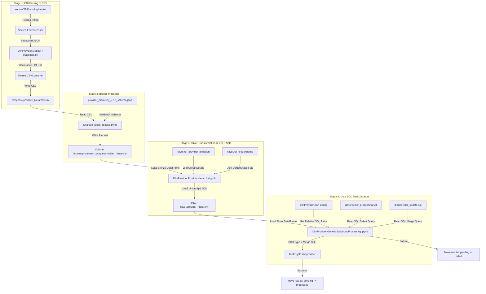

# 274-Only Provider Ingestion Dimension Pipeline

This repository contains the production-grade, declarative, configuration-driven ETL pipeline for processing EDI 274 (Healthcare Provider Directory) feeds. This project focuses **exclusively on the 274 directory feed**, projecting all 837 claim-dependent provider demographics, specialties, and bridge tables as `NULL` in the final Gold table.

The codebase is aligned to be identical in structure and orchestration flow to the parallel Member dimension project.

---

## 1. Project Directory Layout

```
claimprocessing_provider274/
├── DDL/
│   └── DimProvider/
│       ├── gold_dimprovider.sql
│       └── silver_provider_hierarchy.sql
├── DimProvider/
│   ├── Bronze/
│   │   └── Schema/
│   │       └── provider_hierarchy_7.12_schema.json
│   ├── EDIProcessing/
│   │   ├── __init__.py
│   │   ├── mapper.py
│   │   └── mappings.py
│   ├── Gold/
│   │   ├── Dataprocessing/
│   │   │   └── dimprovider_processing.sql   <-- Standalone SQL script
│   │   ├── DataUpdate/
│   │   │   └── dimprovider_update.sql       <-- Standalone MERGE script
│   │   ├── Notebooks/
│   │   │   └── GenericSubGroupProcessing.ipynb
│   │   └── Schema/
│   │       └── dimProvider.json             <-- Stores relative file paths to SQL scripts
│   ├── Silver/
│   │   └── Notebooks/
│   │       └── ProviderHierarchy.ipynb
│   ├── dimprovider_pipeline.ipynb           <-- Renamed entry orchestrator
│   └── ddl_executor.ipynb
├── Shared/
│   ├── CommonMethods/
│   │   └── Helpers/
│   │       ├── CreateUserDefinedFunctions.ipynb
│   │       ├── ErrorHandling.ipynb
│   │       ├── FileHandling.ipynb
│   │       └── SynJSONCreatorClass.ipynb
│   ├── EDIProcessing/
│   │   ├── __init__.py
│   │   ├── csvconverter.py
│   │   └── ediprocessing.py
│   └── Notebooks/
│       ├── FilesToProcess.ipynb
│       └── MoveFileToProcess.ipynb
├── source/
│   └── 274/
│       └── pending/
└── temp/
|
|__ log/
```

---

## 2. Stage-wise Data Flow Diagram



---

## 3. Introduction to EDI 274 (Healthcare Provider Directory)

For data engineers or business analysts who do not have a background in medical billing or EDI (Electronic Data Interchange) structures, here is a simple explanation of how this format is built:

### What is EDI 274?
An **EDI 274** is a standardized text file used by healthcare systems, clinics, and insurance payers to exchange directory information. It answers questions like:
*   Who is the doctor? (NPI, Name)
*   Where do they practice? (Practice Address, Phone Number, Fax)
*   Which billing group or hospital network do they belong to? (TIN, Hospital Name)
*   When is this relationship active? (Start/End dates)

### Loop Structures (How data is grouped)
EDI files do not look like neat Excel files. Instead, they represent hierarchical data using "Loops". Think of loops as parent-child folders:
*   **Loop 2000A (Provider Organization/Billing Loop)**: Contains information about the clinic, hospital, or practice group (e.g. Johns Hopkins Hospital).
*   **Loop 2000B (Individual Practitioner Loop)**: Contains details about the actual doctors working at that hospital (e.g. Dr. John Doe).
*   **Loop 2300 (Practice Location Details)**: Nestled inside the doctor loop to list the physical addresses of their clinics.

---

## 4. 274 Dimension Staging Columns & Definitions

Below is the definition of all **46 columns** processed in the Bronze and Silver staging layers:

| Column Name | Data Type | Description | Source EDI 274 Segment / Loop |
|---|---|---|---|
| `TEMPLATE` | string | CSV structure validation placeholder. | Static value `'TEMPLATE'` |
| `PROVIDERID` | string | Unique identifier of the provider. | `NM1*1P` Loop (uses `nm111_111` or `identifier`) |
| `PROVIDERLASTNAME` | string | Full name of the doctor or clinic organization. | `NM1*1P` Loop (concatenates first + middle + last name) |
| `PROVIDERNPI` | string | National Provider Identifier (NPI). | `NM1*1P` Loop (`nm111_111` or `identifier`) |
| `LOCATIONGROUPID` | string | Group submitter ID or associated clinic NPI. | `NM1*41` Submitter ID or `NM1*85` Clinic NPI |
| `LOCATIONRANKING` | integer | Priority indicator of the location. | Static integer `1` |
| `LOCATIONIDTYPE` | string | Role of record: `rendering`, `billing`, or `rendering to billing`. | Calculated dynamically in Silver layer |
| `LOCATIONID` | string | ID of location: Doctor NPI (rendering) or TIN (billing/link). | `NM1*1P` NPI (Rendering) or `LOCATIONTIN` (Billing/Link) |
| `LOCATIONDESC` | string | Name of the location/practitioner profile. | Doctor Name or Clinic Name |
| `LOCATIONTIN` | string | Tax Identification Number (TIN) of clinic. | `REF*EI` or `REF*1H` (Employer ID / TIN) |
| `LOCATIONADDRESS1` | string | Primary street address of the practice location. | `N3` segment of child loop |
| `LOCATIONADDRESS2` | string | Secondary address of the practice location (e.g. Suite). | `N3` segment of child loop |
| `LOCATIONCITY` | string | Practice city. | `N4` segment of child loop |
| `LOCATIONSTATE` | string | Practice state. | `N4` segment of child loop |
| `LOCATIONZIP` | string | Practice zip code. | `N4` segment of child loop |
| `COUNTYCODE` | string | County code resolved dynamically. | `h.COUNTYCODE` (defaults to `null` if unmapped) |
| `PHONENUMBER` | string | Main phone number for provider/clinic. | `PER*AJ` or `PER*IC` (phone number) |
| `FAXNUMBER` | string | Main fax number. | Unmapped (`null`) |
| `CONTACTPERSON` | string | Name of contact person at the clinic. | `PER*AJ` or `PER*IC` (contact name) |
| `DONOTCHASE` | string | Flag showing if provider credential check is bypassed. | Resolved in Silver via `ref_credentialing` |
| `TIER2IDTYPE` | string | Tier 2 ID Qualifier. | Unmapped (`null`) |
| `TIER2ID` | string | NPI of the Tier 2 Clinic Group. | Parent `NM1*85` NPI or `ref_provider_affiliation` |
| `TIER2DESC` | string | Name of the Tier 2 Clinic Group. | Parent `NM1*85` Name or `ref_provider_affiliation` |
| `TIER2ADDRESS1` | string | Primary address of the clinic. | Parent `N3` address or `ref_provider_affiliation` |
| `TIER2ADDRESS2` | string | Secondary address of the clinic. | Unmapped (`null`) |
| `TIER2CITY` | string | City of the clinic. | Parent `N4` city or `ref_provider_affiliation` |
| `TIER2STATE` | string | State of the clinic. | Parent `N4` state or `ref_provider_affiliation` |
| `TIER2ZIP` | string | Zip code of the clinic. | Parent `N4` zip or `ref_provider_affiliation` |
| `TIER3IDTYPE` | string | Tier 3 ID Qualifier. | Unmapped (`null`) |
| `TIER3ID` | string | Identifier of the Tier 3 Health System. | Resolved in Silver via `ref_provider_affiliation` |
| `TIER3DESC` | string | Name of the Tier 3 Health System. | Resolved in Silver via `ref_provider_affiliation` |
| `TIER3ADDRESS1` | string | Address of the Tier 3 entity. | Unmapped (`null`) |
| `TIER3ADDRESS2` | string | Secondary address of the Tier 3 entity. | Unmapped (`null`) |
| `TIER3CITY` | string | City of the Tier 3 entity. | Unmapped (`null`) |
| `TIER3STATE` | string | State of the Tier 3 entity. | Unmapped (`null`) |
| `TIER3ZIP` | string | Zip code of the Tier 3 entity. | Unmapped (`null`) |
| `TIER4IDTYPE` | string | Tier 4 ID Qualifier. | Unmapped (`null`) |
| `TIER4ID` | string | Identifier of the Tier 4 Payer network. | Unmapped (`null`) |
| `TIER4DESC` | string | Name of the Tier 4 Payer network. | Unmapped (`null`) |
| `TIER4ADDRESS1` | string | Address of the Tier 4 entity. | Unmapped (`null`) |
| `TIER4ADDRESS2` | string | Secondary address of the Tier 4 entity. | Unmapped (`null`) |
| `TIER4CITY` | string | City of the Tier 4 entity. | Unmapped (`null`) |
| `TIER4STATE` | string | State of the Tier 4 entity. | Unmapped (`null`) |
| `TIER4ZIP` | string | Zip code of the Tier 4 entity. | Unmapped (`null`) |
| `STARTDATE` | timestamp | Relationship effective start date. | `DTP*007` segment or transaction date in `BHT04` |
| `ENDDATE` | timestamp | Relationship effective end date. | `DTP*008` segment |
| `CLIENT_ID` | string | Submitter / sender ID for multi-tenant data partitioning. | `ISA06` (Interchange Sender ID) |
| `FILE_ID` | string | Interchange Control Number to identify the source file. | `ISA13` (Interchange Control Number) |
| `LOAD_DATETIME` | timestamp | System timestamp when the file was processed. | System-generated by Spark |
| `FILE_LAYOUT_ID` | string | Identifier of file layout (statically set to `'274'`). | Static Configuration |
| `FILE_LAYOUT_DESCRIPTION` | string | Description of file layout (statically set to `'Standard274'`). | Static Configuration |
| `HashKey` | string | Unique SHA-256 signature of the row content. | Spark-generated Hash of all columns |

---

## 5. EDI 274 Envelope & Segment Reference Guide

Healthcare directory files contain structural envelope segments to bundle data safely, followed by transaction segments that map out the provider networks.

### 🌐 The Envelope Components (Universal Wrappers)
These segments are required for all EDI files, not just 274. They act like layers of an envelope to bundle the data safely between trading partners.
* **ISA (Interchange Control Header)**: The absolute outer envelope. It contains the sender ID, receiver ID, date, time, and security passwords. Think of it as the physical delivery box.
* **GS (Functional Group Header)**: The inner envelope that groups similar files together. In this file, it contains the code `HR`, which tells the parsing system: *"Everything inside this group is a Provider Information (274) file."*
* **GE (Functional Group Trailer)**: Closes out the GS inner envelope and contains a count of the transaction sets inside.
* **IEA (Interchange Control Trailer)**: Closes out the entire ISA outer box and verifies that no data was lost during transfer.

---

### 📄 The Transaction Specifications (Specific to EDI 274)
These segments build the internal structure, hierarchies, and specific medical credentials of the provider network.

| Segment ID | Segment Name | What it Specifies in the EDI 274 File |
|---|---|---|
| **ST** | Transaction Set Header | Marks the start of the actual 274 data layout and defines the specific HIPAA regulatory sub-version (e.g., `005010X292`). |
| **BHT** | Beginning of Hierarchical Transaction | Sets the operational purpose of the file (e.g., whether this is an original data load, an update, or a retransmission). |
| **HL** | Hierarchical Level | The core engine of the 274. It establishes the parent-child relationships that connect the Insurance Payer $\rightarrow$ Hospital Facility $\rightarrow$ Individual Doctor. |
| **NM1** | Individual or Organizational Name | Transmits the literal name of the entity in that loop (e.g., "Aetna", "Johns Hopkins Hospital", or "John Doe"). |
| **PER** | Administrative Communications Contact | Contains phone numbers, emails, and fax numbers for specific departments or personnel. |
| **N3** | Address Information | The street-level address lines for the practice locations or facilities. |
| **N4** | Geographic Location | The city, state, zip code, and country data for the physical location. |
| **REF** | Reference Information | Transmits critical legal identifiers like State License Numbers, Medicaid IDs, or Federal Tax IDs (EIN). |
| **PRV** | Provider Specialty / Taxonomy | Contains the healthcare provider taxonomy codes detailing their medical specialty (e.g., General Practice vs. Cardiology). |
| **DMG** | Demographic Information | Specific individual traits of a human provider, such as Date of Birth and Gender. |
| **LUI** | Language Indicator | Specifies languages spoken by the doctor or supported at the clinic location. |
| **HSD** | Health Care Delivery | Conveys scheduling parameters (e.g., open hours, days available, or whether they are taking new patients). |
| **TPB** | Third-Party Benefit | Explicitly defines which commercial insurance plans, HMO networks, or PPO products this doctor participates in. |
| **N1** | Name | Defines external parent companies, joint ventures, or Independent Physician Associations (IPAs) the doctor belongs to. |
| **ACT** | Account Cross-Reference Number | Tracks contracts, system account groupings, or vendor control numbers between platforms. |
| **NX1** | Real Estate / Property Location Pointer | A structural marker that says, *"The segments immediately following this specify traits for this specific branch office location."* |
| **EDU** | Educational Background | Identifies the medical school attended, degrees earned (MD, DO), and training credentials. |
| **DTP** | Date or Time Period | Tracks critical dates associated with other loops, such as Medical School Graduation Date or Board Certification Effective Date. |
| **LCC** | Licensing and Board Certification | Transmits official board certification statuses (e.g., American Board of Internal Medicine). |
| **SE** | Transaction Set Trailer | Marks the end of the 274 data segment array and includes a line count to verify file integrity. |

---

## 6. Detailed Column-by-Column Deep Dives

### 6.1 Detailed Silver Column Deep Dive (Source, Split Behavior, and Purpose)

Below is the detailed specification of how each key column behaves under the Silver 1-to-3 record explosion:

---

#### 1. CLIENT_ID
*   **Source**: Extracted from the outer envelope's Interchange Sender ID (`ISA06`).
*   **Behavior in Split**: Projected uniformly as `h.CLIENT_ID` (value: `'SENDERID'`) across all 3 rows.
*   **Purpose**: Used for multi-tenant database partitioning. It allows filtering of data belonging to a specific sender or insurance plan.

---

#### 2. FILE_ID
*   **Source**: Extracted from the Interchange Control Number (`ISA13`).
*   **Behavior in Split**: Projected uniformly as `h.FILE_ID` (value: `'000000123'`) across all 3 rows.
*   **Purpose**: Establishes data lineage and audit tracking. If a record contains invalid data, you can look up `FILE_ID` to find the exact raw file that imported it.

---

#### 3. LOAD_DATETIME
*   **Source**: Generated dynamically by the Spark ingestion notebook using `current_timestamp()`.
*   **Behavior in Split**: Projected uniformly as the load timestamp across all 3 rows.
*   **Purpose**: Determines data freshness and aids incremental daily loads.

---

#### 4. FILE_LAYOUT_ID & FILE_LAYOUT_DESCRIPTION
*   **Source**: Statically configured in `Provider_Pipeline.ipynb` (values: `'274'` and `'Standard274'`).
*   **Behavior in Split**: Projected uniformly across all 3 rows.
*   **Purpose**: Identifies the mapping layout structure. This helps downstream processes differentiate 274 directory records from 834 member or 837 claim records in a shared data lake.

---

#### 5. PROVIDERID
*   **Source & Behavior in Split**:
    *   *Rendering Row*: Doctor's NPI (e.g. `'1982736452'`) from the `NM1*1P` segment.
    *   *Billing Row*: Clinic's Tax ID / `LOCATIONTIN` (e.g. `'123456789'`).
    *   *Linkage Row*: Doctor's NPI (e.g. `'1982736452'`).
*   **Purpose**: Serves as the primary identification key for the entity represented by the row (the Doctor or the Clinic). In the Linkage row, it serves as the parent NPI.

---

#### 6. PROVIDERLASTNAME
*   **Source & Behavior in Split**:
    *   *Rendering Row*: Doctor's combined Full Name (e.g. `'JOHN M DOE'`).
    *   *Billing Row*: Name of the Billing Clinic/Hospital (e.g. `'JOHNS HOPKINS HOSPITAL'`), resolved via `coalesce(TIER2DESC, PROVIDERLASTNAME)`.
    *   *Linkage Row*: Doctor's combined Full Name (e.g. `'JOHN M DOE'`).
*   **Purpose**: Provides the primary human-readable display name for the entity in database reports.

---

#### 7. PROVIDERNPI
*   **Source & Behavior in Split**:
    *   *Rendering Row*: Doctor's individual NPI (`'1982736452'`).
    *   *Billing Row*: Clinic's Group NPI (`TIER2ID` e.g. `'1992837465'`).
    *   *Linkage Row*: Doctor's individual NPI.
*   **Purpose**: Stores the universal 10-digit National Provider Identifier required to validate and match medical insurance claims.

---

#### 8. LOCATIONGROUPID
*   **Source**: Mapped from the Submitter ID (`NM1*41`) or Billing Provider ID (`NM1*85`).
*   **Behavior in Split**: Projected uniformly as `'AETNA123'`.
*   **Purpose**: Identifies the payer's internal network or contract plan grouping under which this directory record is registered.

---

#### 9. LOCATIONRANKING
*   **Source**: Statically initialized as `1`.
*   **Behavior in Split**: Projected uniformly as `1`.
*   **Purpose**: Marks the location priority. A rank of `1` indicates this location is the provider's primary office. Secondary locations are ranked higher (`2`, `3`, etc.).

---

#### 10. LOCATIONIDTYPE
*   **Source**: Calculated dynamically in the Silver query.
*   **Behavior in Split**:
    *   *Rendering Row*: Hardcoded to **`'rendering'`**.
    *   *Billing Row*: Hardcoded to **`'billing'`**.
    *   *Linkage Row*: Hardcoded to **`'rendering to billing'`**.
*   **Purpose**: The core discriminator column. It defines the structural role of the row so downstream analytical scripts can tell doctors, clinics, and relationships apart.

---

#### 11. LOCATIONID
*   **Source & Behavior in Split**:
    *   *Rendering Row*: Doctor's individual NPI (`'1982736452'`).
    *   *Billing Row*: Clinic's Tax ID / `LOCATIONTIN` (`'123456789'`).
    *   *Linkage Row*: Clinic's Tax ID / `LOCATIONTIN` (`'123456789'`).
*   **Purpose**: Identifies the target parent location or organization ID. In the Linkage row, this represents the target clinic where the doctor renders services.

---

#### 12. LOCATIONDESC
*   **Source & Behavior in Split**:
    *   *Rendering Row*: Doctor's combined Full Name (`'JOHN M DOE'`).
    *   *Billing Row*: Clinic Group Name (`'JOHNS HOPKINS HOSPITAL'`).
    *   *Linkage Row*: Clinic Group Name (`'JOHNS HOPKINS HOSPITAL'`).
*   **Purpose**: Serves as the display description for the clinic location or practice.

---

#### 13. LOCATIONTIN
*   **Source**: Mapped from the `REF*EI` (Employer ID) segment.
*   **Behavior in Split**: Projected uniformly as `'123456789'` across all 3 rows.
*   **Purpose**: Records the Tax Identification Number of the location. Essential for routing financial payments to the correct organization.

---

#### 14. Addresses (LOCATIONADDRESS1, LOCATIONADDRESS2, LOCATIONCITY, LOCATIONSTATE, LOCATIONZIP)
*   **Source**: Mapped from `N3` (street) and `N4` (city/state/zip) loops.
*   **Behavior in Split**:
    *   *Rendering Row*: Practice location address lines (`'600 N WOLFE ST'`, `'STE 300'`, `'BALTIMORE'`, `'MD'`, `'21287'`).
    *   *Billing & Linkage Rows*: Coalesced to use the Clinic Group's address (`TIER2ADDRESS1` etc.), falling back to the practice address if empty.
*   **Purpose**: Stores physical address data for directory geo-searching and claims address-matching.

---

#### 15. County & Contact Info (COUNTYCODE, PHONENUMBER, FAXNUMBER, CONTACTPERSON)
*   **Source**: Mapped from the contact `PER` loop and the Bronze schema.
*   **Behavior in Split**:
    *   `COUNTYCODE` evaluates dynamically using `h.COUNTYCODE` (resolving to `null` if unmapped in the raw feed, bypassing legacy hardcoding).
    *   `FAXNUMBER` evaluates to `null` (placeholder).
    *   `PHONENUMBER` evaluates to `'4105551111'`.
    *   `CONTACTPERSON` evaluates to `'MAIN APPOINTMENTS'`.
*   **Purpose**: Direct contact channels for provider office scheduling or administrative inquiries.

---

#### 16. DONOTCHASE
*   **Source**: Mapped by joining the `silver.ref_credentialing` reference table on NPI.
*   **Behavior in Split**: Defaults to `'N'` (No) if unmapped in reference tables.
*   **Purpose**: Operational flag for the provider relations team. `'Y'` (Yes) means do not call the doctor's office for credential updates (e.g. if they are part of an auto-updated health system). `'N'` (No) allows phone follow-up.

---

#### 17. TIER2ID & TIER2DESC (Clinic Group)
*   **Source**: Parent `NM1*85` segment or the `ref_provider_affiliation` reference table.
*   **Behavior in Split**: Maps to the hospital/clinic group organization (NPI: `'1992837465'`, Description: `'JOHNS HOPKINS HOSPITAL'`).
*   **Purpose**: Identifies the Tier 2 Clinic Group organization that the practitioner renders services under.

---

#### 18. TIER3ID & TIER3DESC (Health System)
*   **Source**: Resolved by joining the `ref_provider_affiliation` reference table in the Silver layer.
*   **Behavior in Split**: Evaluates to the Health System name (e.g. *Johns Hopkins Medicine*). In our test run, it evaluates to `null` due to empty reference tables.
*   **Purpose**: Identifies the Tier 3 corporate parent corporation for negotiations and grouping.

---

#### 19. TIER4ID & TIER4DESC (Network/Payer)
*   **Source**: Evaluates to `null`.
*   **Purpose**: Placeholder for mapping the doctor to specific insurance plans/networks.

---

#### 20. STARTDATE & ENDDATE
*   **Source**: Mapped from `DTP*007` (Effective Date) and `DTP*008` (Expiration Date).
*   **Behavior in Split**: `STARTDATE` evaluates to `'20260628'` and `ENDDATE` is `null`.
*   **Purpose**: Establishes the relationship's active validity timeline to match against service dates on claims.

---

#### 21. HashKey
*   **Source**: Spark-generated SHA-256 hash across all row values.
*   **Purpose**: acts as a unique signature of the row content to quickly detect changed records and execute SCD Type 2 upserts in the Gold layer.

---

### 6.2 Detailed Gold Column Deep Dive

Below is the detailed specification of how each key column is mapped, structured, and behaves in the Gold `dimprovider` master table:

---

#### 1. providerKey
*   **Source**: Spark-generated `HASH()` of all mapped column values concatenated with a pipe (`|`) character.
*   **Purpose**: acts as the surrogate key for the Slowly Changing Dimension (SCD) Type 2 logic. Used to match and identify updates (if a doctor's address or phone changes, the key changes, triggering history expiration).

---

#### 2. providerID
*   **Source**: Mapped directly from `pgr.PROVIDERID` in Silver.
    *   *Rendering Doctor*: Doctor's individual NPI (e.g. `'1982736452'`).
    *   *Billing Clinic*: Clinic's Tax ID / `LOCATIONTIN` (e.g. `'123456789'`).
    *   *Linkage Relationship*: Doctor's NPI.
*   **Purpose**: Serves as the permanent business primary key to track the unique entity or linkage relationship. Used in `MERGE` scripts as the match key.

---

#### 3. effectiveStartDate, effectiveEndDate, and isCurrent
*   **Source**: Managed dynamically by the SCD Type 2 merge logic:
    *   `effectiveStartDate` = `CURRENT_DATE()` on insert.
    *   `effectiveEndDate` = `null` initially (updated to `current_date()` if updated).
    *   `isCurrent` = `1` initially (updated to `0` if updated).
*   **Purpose**: Reconstructs provider directory history. It allows time-travel reporting to verify the doctor's active details on the exact date a claim was made.

---

#### 4. npi & tin
*   **Source**:
    *   `npi`: Mapped from `pgr.PROVIDERNPI` in Silver.
    *   `tin`: Mapped from `pgr.LOCATIONTIN` in Silver.
*   **Purpose**: Standard healthcare regulatory identifiers used by claim engines to match claims to the master registry.

---

#### 5. lastName, firstName, and middleName
*   **Source**:
    *   `lastName`: Mapped directly from `pgr.PROVIDERLASTNAME` (holds Doctor Full Name or Clinic Name).
    *   `firstName` & `middleName`: Projected statically as `NULL`.
*   **Purpose**: Holds the display name of the provider. First and middle names are unmapped (`NULL`) under the 274-Only design to prevent dependencies on claim transaction files (837 feeds).

---

#### 6. phoneNumber & Addresses (address1, address2, city, state, zipCode)
*   **Source**: Mapped directly from matching Silver columns:
    *   `phoneNumber` $\leftarrow$ `pgr.PHONENUMBER`
    *   `address1` $\leftarrow$ `pgr.LOCATIONADDRESS1`
    *   `address2` $\leftarrow$ `pgr.LOCATIONADDRESS2`
    *   `city` $\leftarrow$ `pgr.LOCATIONCITY`
    *   `state` $\leftarrow$ `pgr.LOCATIONSTATE`
    *   `zipCode` $\leftarrow$ `pgr.LOCATIONZIP`
*   **Purpose**: Physical contact channels and locations used by search directories and geocoding engines.

---

#### 7. practiceCode & practiceName
*   **Source**: Mapped from the Silver table's `LOCATIONID` and `LOCATIONDESC`.
*   **Purpose**: Links the provider row to the specific clinic group or office location where the services are rendered.

---

#### 8. providerOrgCode & providerOrgName
*   **Source**:
    *   `providerOrgCode` $\leftarrow$ `pgr.LOCATIONTIN`
    *   `providerOrgName` $\leftarrow$ `pgr.TIER2DESC` (always Clinic Group name, resolving doctor organizational associations).
*   **Purpose**: Identifies the parent Provider Organization (PO or IPA group) that owns the practice locations for corporate billing and reporting.

---

#### 9. providerSpecialtyDescription
*   **Source**: Mapped via `CASE WHEN pgr.PROVIDERNPI IS NULL THEN '' ELSE pgr.LOCATIONDESC END`.
*   **Purpose**: Provides a description of the provider's clinic network or specialty group association.

---

#### 10. Specialty & Taxonomy Code Placeholders
*   **Columns**: `taxonomyCode1-5`, `hpSpecialtyCode1-5`, `advProviderSpecialtyCode1-5`
*   **Source**: Projected statically as `NULL`.
*   **Purpose**: Under the 274-Only design, specialty code lookups are claim-dependent (837-dependent) features. To remain self-contained, they are set to `NULL` in the directory dimension.

---

#### 11. Clinical & Contract Placeholders
*   **Columns**: `isPrescribePrivilege`, `providerDEA`, `payerID`, `isContracted`, `providerHAI`, `hospitalID`
*   **Source**: Mapped as `NULL`.
*   **Purpose**: Placeholders for tracking prescription privileges, DEA registration numbers, contracted statuses, and hospital affiliations, which are managed outside of the demographics Loop.

---

#### 12. Quality Reporting & Program Columns
*   **Source**:
    *   `isExcludedFromProviderReporting` & `altProvReporting1-10`: Set to `NULL`.
    *   `programType` = `'Targeted'` (statically initialized).
    *   `practiceTargetedStatus` = `'New - Targeted'` (statically initialized).
    *   `ProductID` & `ProviderType`: Set to `NULL`.
*   **Purpose**: Custom analytical indicators used to exclude certain research/retired doctors from regulatory reports, and track active clinical quality programs.

---

## 7. Explanation of Organizational Tiers (Tiers 1 to 5)

In healthcare directory processing, providers and clinic groups are organized hierarchically:

* **Tier 1 (Practitioner Level)**: Represents the individual practitioner (the doctor, clinician) who performs the medical service. Key identifier is the individual doctor's NPI.
* **Tier 2 (Location / Practice Group Level)**: Represents the physical office, clinic location, or group practice where the doctor practices and that bills for the services. Key identifier is the Clinic NPI (`TIER2ID`) and billing Tax ID (`LOCATIONTIN`).
* **Tier 3 (Health System Level)**: The hospital network, parent organization, or corporate health system that owns or manages multiple Tier 2 practice locations (e.g. *Johns Hopkins Medicine*). Resolved by joining the reference table `ref_provider_affiliation`.
* **Tier 4 (Payer Network Level)**: The highest corporate tier representing the payer network or specific insurance plan network (e.g. *Aetna Health*).
* **Tier 5 (National / Federal Registry Level)**: Represents national registries (like CMS NPPES or federal datasets) used for verification of doctor and entity identifiers.

---

## 8. Reference Tables & Data Enrichment Strategy

In Stage 3 (Silver layer), the staging pipeline joins the Bronze directory record with two reference tables in your database:
1. **`silver.ref_provider_affiliation`**: Mapped using the clinic Tax ID (`LOCATIONTIN`).
2. **`silver.ref_credentialing`**: Mapped using the doctor NPI (`PROVIDERID`).

### Why are they needed?
* **Enriching Incomplete Files (Fallback Lookup)**: While large hospital groups submit complete files with Tier 2 (Clinic Group) names and Tier 3 (Health System) names, solo practitioners send files containing *only* their name, NPI, and Tax ID. To ensure every database record has its clinic group name, we use `ref_provider_affiliation` to look up and populate the missing descriptions based on their Tax ID.
* **Internal Business Flags**: The `DONOTCHASE` flag (which indicates if provider credential updates are bypassed) is managed internally by your credentialing team. This information is never sent inside the raw EDI 274 file. We join `ref_credentialing` on the doctor NPI to fetch and inject this clinical status.

---

## 9. Ingestion Isolation (Zero Dependency on 837 Claims)

This ingestion pipeline is designed to be **100% self-contained and isolated from the 837 claim ingestion process**. 
* In a combined system, columns like provider first/middle names, billing tax identifiers, or taxonomy qualifications are sometimes populated from the 837 claims feed.
* For this 274-only implementation, all such 837-dependent columns (such as `firstName`, `middleName`, `providerDEA`, `taxonomyCode1-5`, `hpSpecialtyCode1-5`, and `isContracted`) are projected as **`NULL`** in `dimProvider.json`:
  ```json
  CAST(NULL AS string) AS firstName,
  CAST(NULL AS string) AS middleName,
  CAST(NULL AS string) AS providerDEA,
  ...
  ```
This guarantees that the 274 directory feed runs completely independently without any dependency on active claims processing.

---

## 10. EDI 274 Multi-Level Organizational Hierarchy Structure

The EDI 274 format uses **Hierarchical Level (HL) segments** to represent organizational relationships. The `HL` segment defines the structure using:
* `HL01` (Hierarchical ID)
* `HL02` (Parent Hierarchical ID)
* `HL03` (Level Code: `20` = Source/Network, `21` = Group/Clinic, `22` = Individual Doctor)
* `HL04` (Child Code: `1` = has children, `0` = has no children)

---

### EXAMPLE 1: 2-Level Hierarchy (Individual Practitioner $\rightarrow$ Clinic Group)
This represents a standard relationship where an individual doctor renders services at a clinic location:

```
HL*1**20*1~                                   <-- Parent (Level ID: 1, Level Code: 20)
NM1*85*2*PROVIDER NAME*****XX*1234567893~     <-- Clinic Name & NPI (Tier 2)
N3*123 MAIN STREET~                           <-- Clinic Street Address
N4*CITY*STATE*ZIP*COUNTRY CODE~               <-- Clinic City, State, Zip
REF*EI*123456789~                             <-- Clinic Tax ID (TIN)
PER*IC*CONTACT NAME*TE*PHONE NUMBER~         <-- Clinic Contact details
PRV*BI*PXC*207Q00000X~                        <-- Clinic Taxonomy/Specialty
DMG*D8*19700101*M~                            <-- Demographics placeholder

HL*2*1*21*1~                                  <-- Child (Level ID: 2, Parent ID: 1, Level Code: 21)
NM1*1P*1*RELATED PROVIDER NAME*****XX*9876543210~ <-- Doctor Name & NPI (Tier 1)
N3*456 SECOND AVENUE~                         <-- Doctor Office Street Address
N4*CITY*STATE*ZIP*COUNTRY CODE~               <-- Doctor Office City, State, Zip
PRV*AT*PXC*208D00000X~                        <-- Doctor Taxonomy/Specialty
```

#### Mapping Breakdown:
1. **The Parent (`HL*1`)** establishes the **Tier 2 Clinic Group** details. 
   * Clinic Name (`PROVIDER NAME`), Clinic NPI (`1234567893`), and Clinic Address (`123 MAIN STREET`) are mapped directly to `TIER2DESC`, `TIER2ID`, and `TIER2ADDRESS1`.
   * The `REF*EI` segment provides the clinic's **Tax ID (`LOCATIONTIN`)**.
2. **The Child (`HL*2`)** establishes the **Tier 1 Doctor** details.
   * `HL*2*1` indicates that `HL*2` is a child of `HL*1`, linking the doctor to the clinic.
   * Doctor Name (`RELATED PROVIDER NAME`) and NPI (`9876543210`) are mapped to `PROVIDERLASTNAME` and `PROVIDERNPI`.

---

### EXAMPLE 2: 3-Level Hierarchy (Practitioner $\rightarrow$ Hospital $\rightarrow$ Network/Payer)
This represents a complex structure where an individual doctor practices at a hospital, which operates under a specific health network/payer contract:

```
ST*274*0001~
BGN*11*FILE20260627*20260627*145300******2~

hl*1**20*1~                                   <-- Top-Level Parent (Level ID: 1, Level Code: 20)
NM1*85*2*AETNA HEALTH*****PI*AETNA123~         <-- Network/Payer Name & ID (Tier 4)

HL*2*1*21*1~                                  <-- Mid-Level Child (Level ID: 2, Parent ID: 1, Level Code: 21)
NM1*1P*2*JOHNS HOPKINS HOSPITAL*****XX*1992837465~ <-- Hospital Group Name & NPI (Tier 2)
N3*600 N WOLFE ST~                            <-- Hospital Address
N4*BALTIMORE*MD*21287~

hl*3*2*22*0~                                  <-- Bottom-Level Child (Level ID: 3, Parent ID: 2, Level Code: 22)
NM1*1P*1*DOE*JOHN*M*DR**XX*1982736452~        <-- Individual Doctor Name & NPI (Tier 1)
PRV*PE*PXC*207Q00000X~                        <-- Doctor Taxonomy/Specialty
```

#### Mapping Breakdown:
1. **Level 1 Parent (`hl*1`)**: The top level represents **Aetna Health** (Payer Network). This maps to **Tier 4** (`TIER4ID` = `AETNA123`, `TIER4DESC` = `AETNA HEALTH`).
2. **Level 2 Child (`HL*2*1`)**: Linked to Level 1. Represents **Johns Hopkins Hospital**. This maps to **Tier 2** (`TIER2ID` = `1992837465`, `TIER2DESC` = `JOHNS HOPKINS HOSPITAL`, `TIER2ADDRESS1` = `600 N WOLFE ST`).
3. **Level 3 Child (`hl*3*2`)**: Linked to Level 2. Represents the individual practitioner, **Dr. John M Doe**. This maps to **Tier 1** (`PROVIDERNPI` = `1982736452`, `PROVIDERLASTNAME` = `JOHN M DOE`).

#### Database Resolution (1-to-3 Split):
* **Rendering Record**: Doctor `JOHN M DOE` (`1982736452`) at location address `600 N WOLFE ST`.
* **Billing Record**: Hospital `JOHNS HOPKINS HOSPITAL` (`1992837465`) at billing address `600 N WOLFE ST`.
* **Link Record**: Connects Doctor NPI `1982736452` to Hospital NPI `1992837465` under the Network Payer ID `AETNA123`.

---

## 11. How to Test in Databricks

1. In Databricks, pull the latest commits from the remote branch.
2. Run the **`ddl_executor`** notebook to create schemas and tables under catalog `274`.
3. Put your raw EDI 274 files under the volume path `/Volumes/274/bronze/processed_parquet/provider_hierarchy` or place them in `source/274/pending/`.
4. Run the orchestrator notebook **`dimprovider_pipeline`** (with the widget `ClientContainer` set to `274`).
5. Verify that the files are moved to `processed` only after a successful Gold merge, and that the data is split into 3 rows correctly in `` `274`.silver.provider_hierarchy `` and `` `274`.gold.dimprovider ``.
