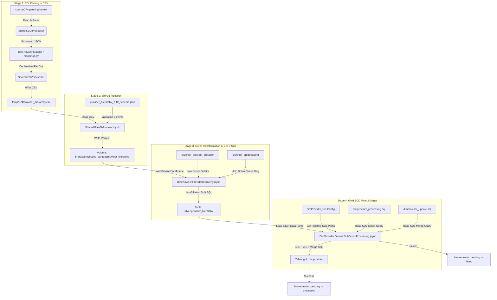

# 274-Only Provider Ingestion Dimension Pipeline

This repository contains the production-grade, declarative, configuration-driven ETL pipeline for processing EDI 274 (Healthcare Provider Directory) feeds. This project focuses **exclusively on the 274 directory feed**, projecting all 837 claim-dependent provider demographics, specialties, and bridge tables as `NULL` in the final Gold table.

The codebase is aligned to be identical in structure and orchestration flow to the parallel Member dimension project.

---

## 1. Project Directory Layout

```
claimprocessing_provider274/
├── DDL/
│   └── DimProvider/
│       ├── gold_dimprovider.sql
│       └── silver_provider_hierarchy.sql
├── DimProvider/
│   ├── Bronze/
│   │   └── Schema/
│   │       └── provider_hierarchy_7.12_schema.json
│   ├── EDIProcessing/
│   │   ├── __init__.py
│   │   ├── mapper.py
│   │   └── mappings.py
│   ├── Gold/
│   │   ├── Dataprocessing/
│   │   │   └── dimprovider_processing.sql   <-- Standalone SQL script
│   │   ├── DataUpdate/
│   │   │   └── dimprovider_update.sql       <-- Standalone MERGE script
│   │   ├── Notebooks/
│   │   │   └── GenericSubGroupProcessing.ipynb
│   │   └── Schema/
│   │       └── dimProvider.json             <-- Stores relative file paths to SQL scripts
│   ├── Silver/
│   │   └── Notebooks/
│   │       └── ProviderHierarchy.ipynb
│   ├── dimprovider_pipeline.ipynb           <-- Renamed entry orchestrator
│   └── ddl_executor.ipynb
├── Shared/
│   ├── CommonMethods/
│   │   └── Helpers/
│   │       ├── CreateUserDefinedFunctions.ipynb
│   │       ├── ErrorHandling.ipynb
│   │       ├── FileHandling.ipynb
│   │       └── SynJSONCreatorClass.ipynb
│   ├── EDIProcessing/
│   │   ├── __init__.py
│   │   ├── csvconverter.py
│   │   └── ediprocessing.py
│   └── Notebooks/
│       ├── FilesToProcess.ipynb
│       └── MoveFileToProcess.ipynb
├── source/
│   └── 274/
│       └── pending/
└── temp/
```

---

## 2. Stage-wise Data Flow Diagram



---

## 3. Introduction to EDI 274 (Healthcare Provider Directory)

For data engineers or business analysts who do not have a background in medical billing or EDI (Electronic Data Interchange) structures, here is a simple explanation of how this format is built:

### What is EDI 274?
An **EDI 274** is a standardized text file used by healthcare systems, clinics, and insurance payers to exchange directory information. It answers questions like:
*   Who is the doctor? (NPI, Name)
*   Where do they practice? (Practice Address, Phone Number, Fax)
*   Which billing group or hospital network do they belong to? (TIN, Hospital Name)
*   When is this relationship active? (Start/End dates)

### Loop Structures (How data is grouped)
EDI files do not look like neat Excel files. Instead, they represent hierarchical data using "Loops". Think of loops as parent-child folders:
*   **Loop 2000A (Provider Organization/Billing Loop)**: Contains information about the clinic, hospital, or practice group (e.g. Johns Hopkins Hospital).
*   **Loop 2000B (Individual Practitioner Loop)**: Contains details about the actual doctors working at that hospital (e.g. Dr. John Doe).
*   **Loop 2300 (Practice Location Details)**: Nestled inside the doctor loop to list the physical addresses of their clinics.

---

## 4. 274 Dimension Staging Columns & Definitions

Below is the definition of all **46 columns** processed in the Bronze and Silver staging layers:

| Column Name | Data Type | Description | Source EDI 274 Segment / Loop |
|---|---|---|---|
| `TEMPLATE` | string | CSV structure validation placeholder. | Static value `'TEMPLATE'` |
| `PROVIDERID` | string | Unique identifier of the provider. | `NM1*1P` Loop (uses `nm111_111` or `identifier`) |
| `PROVIDERLASTNAME` | string | Full name of the doctor or clinic organization. | `NM1*1P` Loop (concatenates first + middle + last name) |
| `PROVIDERNPI` | string | National Provider Identifier (NPI). | `NM1*1P` Loop (`nm111_111` or `identifier`) |
| `LOCATIONGROUPID` | string | Group submitter ID or associated clinic NPI. | `NM1*41` Submitter ID or `NM1*85` Clinic NPI |
| `LOCATIONRANKING` | integer | Priority indicator of the location. | Static integer `1` |
| `LOCATIONIDTYPE` | string | Role of record: `rendering`, `billing`, or `rendering to billing`. | Calculated dynamically in Silver layer |
| `LOCATIONID` | string | ID of location: Doctor NPI (rendering) or TIN (billing/link). | `NM1*1P` NPI (Rendering) or `LOCATIONTIN` (Billing/Link) |
| `LOCATIONDESC` | string | Name of the location/practitioner profile. | Doctor Name or Clinic Name |
| `LOCATIONTIN` | string | Tax Identification Number (TIN) of clinic. | `REF*EI` or `REF*1H` (Employer ID / TIN) |
| `LOCATIONADDRESS1` | string | Primary street address of the practice location. | `N3` segment of child loop |
| `LOCATIONADDRESS2` | string | Secondary address of the practice location (e.g. Suite). | `N3` segment of child loop |
| `LOCATIONCITY` | string | Practice city. | `N4` segment of child loop |
| `LOCATIONSTATE` | string | Practice state. | `N4` segment of child loop |
| `LOCATIONZIP` | string | Practice zip code. | `N4` segment of child loop |
| `COUNTYCODE` | string | County code resolved dynamically. | `h.COUNTYCODE` (defaults to `null` if unmapped) |
| `PHONENUMBER` | string | Main phone number for provider/clinic. | `PER*AJ` or `PER*IC` (phone number) |
| `FAXNUMBER` | string | Main fax number. | Unmapped (`null`) |
| `CONTACTPERSON` | string | Name of contact person at the clinic. | `PER*AJ` or `PER*IC` (contact name) |
| `DONOTCHASE` | string | Flag showing if provider credential check is bypassed. | Resolved in Silver via `ref_credentialing` |
| `TIER2IDTYPE` | string | Tier 2 ID Qualifier. | Unmapped (`null`) |
| `TIER2ID` | string | NPI of the Tier 2 Clinic Group. | Parent `NM1*85` NPI or `ref_provider_affiliation` |
| `TIER2DESC` | string | Name of the Tier 2 Clinic Group. | Parent `NM1*85` Name or `ref_provider_affiliation` |
| `TIER2ADDRESS1` | string | Primary address of the clinic. | Parent `N3` address or `ref_provider_affiliation` |
| `TIER2ADDRESS2` | string | Secondary address of the clinic. | Unmapped (`null`) |
| `TIER2CITY` | string | City of the clinic. | Parent `N4` city or `ref_provider_affiliation` |
| `TIER2STATE` | string | State of the clinic. | Parent `N4` state or `ref_provider_affiliation` |
| `TIER2ZIP` | string | Zip code of the clinic. | Parent `N4` zip or `ref_provider_affiliation` |
| `TIER3IDTYPE` | string | Tier 3 ID Qualifier. | Unmapped (`null`) |
| `TIER3ID` | string | Identifier of the Tier 3 Health System. | Resolved in Silver via `ref_provider_affiliation` |
| `TIER3DESC` | string | Name of the Tier 3 Health System. | Resolved in Silver via `ref_provider_affiliation` |
| `TIER3ADDRESS1` | string | Address of the Tier 3 entity. | Unmapped (`null`) |
| `TIER3ADDRESS2` | string | Secondary address of the Tier 3 entity. | Unmapped (`null`) |
| `TIER3CITY` | string | City of the Tier 3 entity. | Unmapped (`null`) |
| `TIER3STATE` | string | State of the Tier 3 entity. | Unmapped (`null`) |
| `TIER3ZIP` | string | Zip code of the Tier 3 entity. | Unmapped (`null`) |
| `TIER4IDTYPE` | string | Tier 4 ID Qualifier. | Unmapped (`null`) |
| `TIER4ID` | string | Identifier of the Tier 4 Payer network. | Unmapped (`null`) |
| `TIER4DESC` | string | Name of the Tier 4 Payer network. | Unmapped (`null`) |
| `TIER4ADDRESS1` | string | Address of the Tier 4 entity. | Unmapped (`null`) |
| `TIER4ADDRESS2` | string | Secondary address of the Tier 4 entity. | Unmapped (`null`) |
| `TIER4CITY` | string | City of the Tier 4 entity. | Unmapped (`null`) |
| `TIER4STATE` | string | State of the Tier 4 entity. | Unmapped (`null`) |
| `TIER4ZIP` | string | Zip code of the Tier 4 entity. | Unmapped (`null`) |
| `STARTDATE` | timestamp | Relationship effective start date. | `DTP*007` segment or transaction date in `BHT04` |
| `ENDDATE` | timestamp | Relationship effective end date. | `DTP*008` segment |
| `CLIENT_ID` | string | Submitter / sender ID for multi-tenant data partitioning. | `ISA06` (Interchange Sender ID) |
| `FILE_ID` | string | Interchange Control Number to identify the source file. | `ISA13` (Interchange Control Number) |
| `LOAD_DATETIME` | timestamp | System timestamp when the file was processed. | System-generated by Spark |
| `FILE_LAYOUT_ID` | string | Identifier of file layout (statically set to `'274'`). | Static Configuration |
| `FILE_LAYOUT_DESCRIPTION` | string | Description of file layout (statically set to `'Standard274'`). | Static Configuration |
| `HashKey` | string | Unique SHA-256 signature of the row content. | Spark-generated Hash of all columns |

---

## 5. EDI 274 Envelope & Segment Reference Guide

Healthcare directory files contain structural envelope segments to bundle data safely, followed by transaction segments that map out the provider networks.

### 🌐 The Envelope Components (Universal Wrappers)
These segments are required for all EDI files. They act like nested delivery boxes to transfer data safely:
*   **ISA (Interchange Control Header)**: The outermost box. Contains the sender ID, receiver ID, date, time, and control ID.
*   **GS (Functional Group Header)**: The inner group envelope. For this file, it contains the code `HR`, designating it as a Provider Directory feed.
*   **GE (Functional Group Trailer)**: Closes out the functional group and counts the number of transaction sets inside.
*   **IEA (Interchange Control Trailer)**: Closes out the ISA outer envelope and verifies transaction counts to ensure no data was dropped.

---

### 📄 The Transaction Specifications Table
These segments build the internal structure, hierarchies, and specific medical credentials of the provider network.

| Segment ID | Segment Name | What it Specifies in the EDI 274 File |
|---|---|---|
| **ST** | Transaction Set Header | Marks the start of the 274 segment block and specifies the schema version (e.g. `005010X292`). |
| **BHT** | Beginning of Hierarchical Transaction | Defines whether this transaction is an original database load, a correction, or an update. |
| **HL** | Hierarchical Level | Establishes the relationship structure (Parent $\rightarrow$ Child relationship trees). |
| **NM1** | Name | Transmits the literal name of the entity in the loop (e.g., Doctor Name, Clinic Name). |
| **PER** | Administrative Communications Contact | Contains the phone numbers, emails, and contact names for scheduling. |
| **N3** | Address Information | Physical street address lines of the practice location. |
| **N4** | Geographic Location | City, State, and Zip Code. |
| **REF** | Reference Information | Transmits Tax ID (TIN), state license number, or Medicaid identifier. |
| **PRV** | Provider Specialty / Taxonomy | Transmits taxonomy classification codes specifying the provider's specialty. |
| **DMG** | Demographic Information | Individual demographics such as gender or date of birth. |
| **DTP** | Date or Time Period | Tracks effective start (`DTP*007`) and expiration (`DTP*008`) dates. |
| **SE** | Transaction Set Trailer | Marks the end of the transaction set and provides segment counts for validation. |

---

## 6. Detailed Column-by-Column Deep Dive

### 6.1 Silver Layer Columns & Split Behavior

Under the Silver layer transformation, each flat Bronze row is exploded into **three distinct rows** using a `UNION ALL` statement. Below is how the key columns populate under each row type:

#### 1. CLIENT_ID, FILE_ID, & LOAD_DATETIME
*   **Source**: Extracted from envelope headers (`ISA06`, `ISA13`) and Spark system time.
*   **Split Behavior**: Projected identically across all 3 rows.
*   **Purpose**: Establishes audit lineage, tenancy boundaries, and processing timestamps.

#### 2. PROVIDERID & PROVIDERNPI
*   **Rendering Row**: Doctor's individual ID and NPI.
*   **Billing Row**: Clinic's Tax ID (TIN) as the ID, and the Clinic NPI (`TIER2ID`) as the NPI.
*   **Linkage Row**: Doctor's individual NPI.
*   **Purpose**: Unique business keys representing the specific entity of that row.

#### 3. LOCATIONIDTYPE
*   **Rendering Row**: Hardcoded to **`'rendering'`**.
*   **Billing Row**: Hardcoded to **`'billing'`**.
*   **Linkage Row**: Hardcoded to **`'rendering to billing'`**.
*   **Purpose**: Used by downstream reports to filter and categorize records correctly.

#### 4. LOCATIONID & LOCATIONDESC
*   **Rendering Row**: Doctor's NPI as the location ID, and Doctor's full name as the description.
*   **Billing Row**: Clinic's Tax ID (TIN) as the location ID, and Clinic Name as the description.
*   **Linkage Row**: Clinic's Tax ID (TIN) as the location ID, and Clinic Name as the description.
*   **Purpose**: Relates each record to its physical practice profile.

#### 5. COUNTYCODE
*   **Source**: Projected dynamically via `h.COUNTYCODE`.
*   **Split Behavior**: Left as `null` if not supplied in the feed (bypasses static hardcoding to prevent data overriding).
*   **Purpose**: Geocoding location details.

---

### 6.2 Gold Layer master Table Mappings

The Gold table (`dimprovider`) loads staging data from Silver and maps it into a Slowly Changing Dimension (SCD) Type 2 master table:

*   **`providerKey`**: A SHA-256 hash of all row data, used to match and identify updates.
*   **`providerID`**: The primary key from the Silver stage.
*   **`effectiveStartDate`, `effectiveEndDate`, `isCurrent`**: Columns managed by the pipeline to track historical changes (SCD Type 2). When a doctor changes locations, their old record is closed out (`isCurrent = 0`, `effectiveEndDate = today`), and a new active record is created.
*   **`lastName`**: Holds the Doctor's Full Name (for rendering rows) or the Clinic's corporate name (for billing rows).
*   **`providerOrgName`**: Maps to `TIER2DESC` (always the parent Clinic/Hospital Group name), ensuring the doctor row correctly references the clinic organization they work for.

---

## 7. Explanation of Organizational Tiers (Tiers 1 to 5)

Our pipeline organizes the provider network into five hierarchal tiers:

```
[Tier 5: National CMS Registry]
              ▲
[Tier 4: Insurance Payer Network]
              ▲
[Tier 3: Health System Network]
              ▲
[Tier 2: Practice Group / Clinic Location]
              ▲
[Tier 1: Individual Practitioner / Doctor]
```

1.  **Tier 1 (Practitioner Level)**: The individual medical practitioner (the doctor, surgeon, or therapist). Identified by the doctor's individual NPI.
2.  **Tier 2 (Practice Group / Location Level)**: The physical clinic, practice group, or outpatient office where the doctor renders services. Identified by the location Tax ID (`LOCATIONTIN`) and Billing NPI (`TIER2ID`).
3.  **Tier 3 (Health System Level)**: The overarching hospital network or corporate entity that owns the practice locations (e.g. *Johns Hopkins Medicine*). Resolved by reference table joins.
4.  **Tier 4 (Payer Network Level)**: The insurance payer network or product line that contracts with the provider group (e.g. *Aetna Commercial PPO*).
5.  **Tier 5 (Federal / National Registry Level)**: The national registry database (such as CMS NPPES) containing official credential details. Staged for national registry cross-referencing.

---

## 8. Reference Tables & Data Enrichment Strategy

In Stage 3 (Silver layer), we join the incoming Bronze directory data against two reference tables to enrich the profiles:
1.  **`silver.ref_provider_affiliation`**: Joined using the clinic Tax ID (`LOCATIONTIN`). Since solo practitioners often submit files without entering their parent group's corporate details, this join automatically resolves and populates their **Tier 2 (Clinic Name)** and **Tier 3 (Health System Name)** details.
2.  **`silver.ref_credentialing`**: Joined using the doctor NPI (`PROVIDERID`). It fetches the operational credentialing flag **`DONOTCHASE`** (which indicates whether our team is allowed to call their office for credential updates).

---

## 9. Ingestion Isolation (Zero Dependency on 837 Claims)

This pipeline is engineered to be **100% self-contained and isolated from the 837 claims ingestion process**.
*   In traditional pipelines, directories are updated by pulling provider information out of active claims files (837 feeds).
*   In this implementation, all 837-dependent fields (such as taxonomy specialties, DEA registration numbers, or prescription privilege flags) are projected as **`NULL`** in `dimProvider.json`.
*   This ensures that the 274 provider directory pipeline can execute independently without waiting for claim files to process.

---

## 10. EDI 274 Multi-Level Organizational Hierarchy Structure

The EDI 274 format uses **Hierarchical Level (HL) segments** to represent organizational structures. The `HL` segment defines the relationship:
*   `HL01`: Hierarchical ID of the current loop.
*   `HL02`: Parent Hierarchical ID (pointing to the loop that contains this loop).
*   `HL03`: Level Code (`20` = Source/Network, `21` = Group/Clinic, `22` = Individual Doctor).

### Example Hierarchy Scenario
An individual doctor practicing at a hospital location under an insurance payer contract:

```
ST*274*0001~
BGN*11*FILE20260627*20260627*145300******2~

hl*1**20*1~                                   <-- Payer Network (Level ID: 1, Level Code: 20)
NM1*85*2*AETNA HEALTH*****PI*AETNA123~         <-- Tier 4: Network/Payer (Aetna)

HL*2*1*21*1~                                  <-- Hospital Location (Level ID: 2, Parent ID: 1)
NM1*1P*2*JOHNS HOPKINS HOSPITAL*****XX*1992837465~ <-- Tier 2: Hospital Group Name & NPI

hl*3*2*22*0~                                  <-- Individual Practitioner (Level ID: 3, Parent ID: 2)
NM1*1P*1*DOE*JOHN*M*DR**XX*1982736452~        <-- Tier 1: Individual Doctor Details
```

#### Ingestion Outcome:
This structure is parsed and loaded into the database, generating:
1.  **Rendering Record**: Doctor `JOHN M DOE` (`1982736452`) at location `600 N WOLFE ST`.
2.  **Billing Record**: Clinic `JOHNS HOPKINS HOSPITAL` (`1992837465`) at billing address `600 N WOLFE ST`.
3.  **Link Record**: A relationship linking Doctor NPI `1982736452` to Clinic NPI `1992837465` under the Payer Network `AETNA123`.

---

## 11. How to Test in Databricks

Follow these steps to deploy and run the pipeline inside your Databricks workspace:

1.  **Pull Repository**: Pull the latest branch changes into your Databricks Repo space.
2.  **Execute DDLs**: Run the **`ddl_executor`** notebook to create schemas and tables under catalog `274`.
3.  **Load Source Data**: Put your raw EDI 274 test files under the volume path `/Volumes/274/bronze/processed_parquet/provider_hierarchy` or place them in `source/274/pending/`.
4.  **Run Ingestion**: Run the orchestrator notebook **`dimprovider_pipeline`** (verify that the notebook widget parameter `ClientContainer` is set to `274`).
5.  **Verify Target Tables**:
    *   Query `` `274`.silver.provider_hierarchy `` to check the 1-to-3 row splits.
    *   Query `` `274`.gold.dimprovider `` to check the correct `providerOrgName` assignment and SCD Type 2 history columns.
