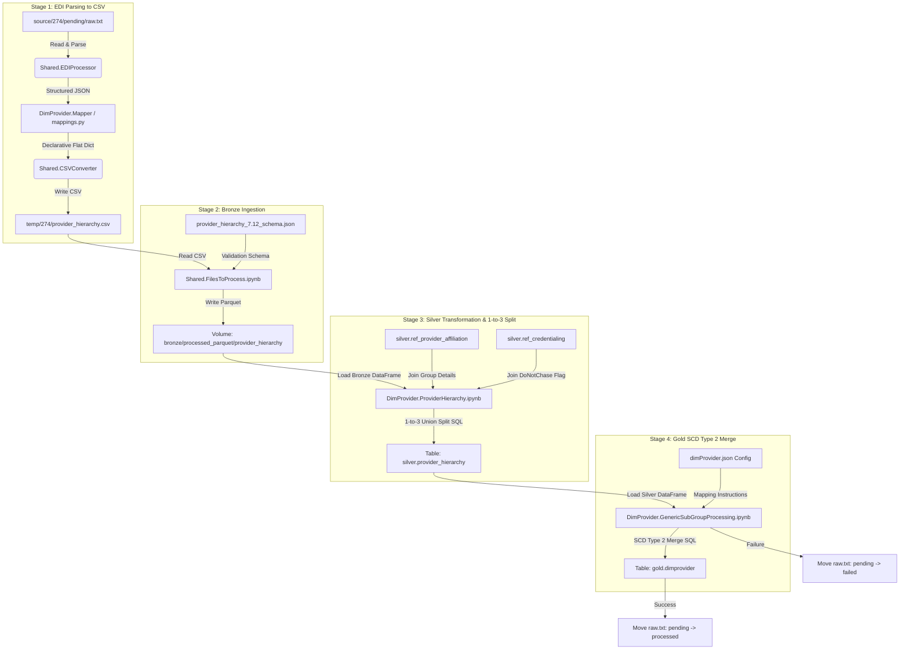

# 274-Only Provider Ingestion Dimension Pipeline

This repository contains the production-grade, declarative, configuration-driven ETL pipeline for processing EDI 274 (Healthcare Provider Directory) feeds. 
This project focuses **exclusively on the 274 directory feed**, projecting all 837 claim-dependent provider demographics, specialties, and bridge tables as `NULL` in the final Gold table.

The codebase is aligned to be identical in structure and orchestration flow to the parallel Member dimension project.

---

## 1. Project Directory Layout

```
claimprocessing_provider274/
├── DDL/
│   └── DimProvider/
│       ├── gold_dimprovider.sql
│       └── silver_provider_hierarchy.sql
├── DimProvider/
│   ├── Bronze/
│   │   └── Schema/
│   │       └── provider_hierarchy_7.12_schema.json
│   ├── EDIProcessing/
│   │   ├── __init__.py
│   │   ├── mapper.py
│   │   └── mappings.py
│   ├── Gold/
│   │   ├── Notebooks/
│   │   │   └── GenericSubGroupProcessing.ipynb
│   │   └── Schema/
│   │       └── dimProvider.json
│   ├── Silver/
│   │   └── Notebooks/
│   │       └── ProviderHierarchy.ipynb
│   ├── Provider_Pipeline.ipynb
│   └── ddl_executor.ipynb
├── Shared/
│   ├── CommonMethods/
│   │   └── Helpers/
│   │       ├── CreateUserDefinedFunctions.ipynb
│   │       ├── ErrorHandling.ipynb
│   │       ├── FileHandling.ipynb
│   │       └── SynJSONCreatorClass.ipynb
│   ├── EDIProcessing/
│   │   ├── __init__.py
│   │   └── csvconverter.py
│   │   └── ediprocessing.py
│   └── Notebooks/
│       ├── FilesToProcess.ipynb
│       └── MoveFileToProcess.ipynb
├── source/
│   └── 274/
│       └── pending/
└── temp/
```

---

## 2. Stage-wise Data Flow Diagram



---

## 3. Explanation of Organizational Tiers (Tier 1 to Tier 4)

In healthcare directory processing, providers and clinic groups are organized hierarchically:

* **Tier 1 (Practitioner Level)**: Represents the individual practitioner (the doctor, clinician) who performs the medical service. Key identifier is the individual doctor's NPI.
* **Tier 2 (Location / Practice Group Level)**: Represents the physical office, clinic location, or group practice where the doctor practices and that bills for the services. Key identifier is the Clinic NPI (`TIER2ID`) and billing Tax ID (`LOCATIONTIN`).
* **Tier 3 (Health System Level)**: The hospital network, parent organization, or corporate health system that owns or manages multiple Tier 2 practice locations (e.g. *Mercy Health System*). Resolved by joining the reference table `ref_provider_affiliation`.
* **Tier 4 (Payer Network Level)**: The highest corporate tier representing the payer network or specific insurance plan network (e.g. *Aetna Health*).

---

## 4. 274 Dimension Staging Columns & Definitions

Below is the definition of all **46 columns** processed in the Bronze and Silver staging layers:

| Column Name | Data Type | Description | Source EDI 274 Segment / Loop |
|---|---|---|---|
| `TEMPLATE` | string | CSV structure validation placeholder. | Static value `'TEMPLATE'` |
| `PROVIDERID` | string | Unique NPI of the rendering doctor. | `NM1*1P` Loop (uses `nm111_111` or `identifier`) |
| `PROVIDERLASTNAME` | string | Full name of the individual doctor. | `NM1*1P` Loop (concatenates first + middle + last name) |
| `PROVIDERNPI` | string | National Provider Identifier (NPI) of doctor. | `NM1*1P` Loop (`nm111_111` or `identifier`) |
| `LOCATIONGROUPID` | string | Group submitter ID or associated clinic NPI. | `NM1*41` Submitter ID or `NM1*85` Clinic NPI |
| `LOCATIONRANKING` | integer | Priority indicator of the location. | Static integer `1` |
| `LOCATIONIDTYPE` | string | Role of record: `rendering`, `billing`, or `rendering to billing`. | Calculated dynamically in Silver layer |
| `LOCATIONID` | string | ID of location: Doctor NPI (rendering) or TIN (billing/link). | `NM1*1P` NPI (Rendering) or `LOCATIONTIN` (Billing/Link) |
| `LOCATIONDESC` | string | Name of the location/practitioner profile. | Doctor Name or Clinic Name |
| `LOCATIONTIN` | string | Tax Identification Number (TIN) of clinic. | `REF*EI` or `REF*1H` (Employer ID / TIN) |
| `LOCATIONADDRESS1` | string | Primary street address of the doctor. | `N3` segment of child loop |
| `LOCATIONADDRESS2` | string | Secondary address of the doctor (e.g. Suite). | `N3` segment of child loop |
| `LOCATIONCITY` | string | Practice city of the doctor. | `N4` segment of child loop |
| `LOCATIONSTATE` | string | Practice state of the doctor. | `N4` segment of child loop |
| `LOCATIONZIP` | string | Practice zip code of the doctor. | `N4` segment of child loop |
| `COUNTYCODE` | string | County code placeholder. | Unmapped (`null`) |
| `PHONENUMBER` | string | Main phone number for provider/clinic. | `PER*AJ` or `PER*IC` (phone number) |
| `FAXNUMBER` | string | Main fax number placeholder. | Unmapped (`null`) |
| `CONTACTPERSON` | string | Name of contact person. | `PER*AJ` or `PER*IC` (contact name) |
| `DONOTCHASE` | string | Flag showing if provider credential check is bypassed. | Resolved in Silver via `ref_credentialing` |
| `TIER2IDTYPE` | string | Tier 2 ID Qualifier placeholder. | Unmapped (`null`) |
| `TIER2ID` | string | NPI of the Tier 2 Clinic Group. | Parent `NM1*85` NPI or `ref_provider_affiliation` |
| `TIER2DESC` | string | Name of the Tier 2 Clinic Group. | Parent `NM1*85` Name or `ref_provider_affiliation` |
| `TIER2ADDRESS1` | string | Primary address of the clinic. | Parent `N3` address or `ref_provider_affiliation` |
| `TIER2ADDRESS2` | string | Secondary address of the clinic. | Unmapped (`null`) |
| `TIER2CITY` | string | City of the clinic. | Parent `N4` city or `ref_provider_affiliation` |
| `TIER2STATE` | string | State of the clinic. | Parent `N4` state or `ref_provider_affiliation` |
| `TIER2ZIP` | string | Zip code of the clinic. | Parent `N4` zip or `ref_provider_affiliation` |
| `TIER3IDTYPE` | string | Tier 3 ID Qualifier placeholder. | Unmapped (`null`) |
| `TIER3ID` | string | Identifier of the Tier 3 Health System. | Resolved in Silver via `ref_provider_affiliation` |
| `TIER3DESC` | string | Name of the Tier 3 Health System. | Resolved in Silver via `ref_provider_affiliation` |
| `TIER3ADDRESS1` | string | Address of the Tier 3 entity. | Unmapped (`null`) |
| `TIER3ADDRESS2` | string | Secondary address of the Tier 3 entity. | Unmapped (`null`) |
| `TIER3CITY` | string | City of the Tier 3 entity. | Unmapped (`null`) |
| `TIER3STATE` | string | State of the Tier 3 entity. | Unmapped (`null`) |
| `TIER3ZIP` | string | Zip code of the Tier 3 entity. | Unmapped (`null`) |
| `TIER4IDTYPE` | string | Tier 4 ID Qualifier placeholder. | Unmapped (`null`) |
| `TIER4ID` | string | Identifier of the Tier 4 Payer network. | Unmapped (`null`) |
| `TIER4DESC` | string | Name of the Tier 4 Payer network. | Unmapped (`null`) |
| `TIER4ADDRESS1` | string | Address of the Tier 4 entity. | Unmapped (`null`) |
| `TIER4ADDRESS2` | string | Secondary address of the Tier 4 entity. | Unmapped (`null`) |
| `TIER4CITY` | string | City of the Tier 4 entity. | Unmapped (`null`) |
| `TIER4STATE` | string | State of the Tier 4 entity. | Unmapped (`null`) |
| `TIER4ZIP` | string | Zip code of the Tier 4 entity. | Unmapped (`null`) |
| `STARTDATE` | timestamp | Relationship effective start date. | `DTP*007` segment or transaction date in `BHT04` |
| `ENDDATE` | timestamp | Relationship effective end date. | `DTP*008` segment |

---

## 5. EDI 274 Multi-Level Organizational Hierarchy Structure

The EDI 274 format uses **Hierarchical Level (HL) segments** to represent organizational relationships. The `HL` segment defines the structure using:
* `HL01` (Hierarchical ID)
* `HL02` (Parent Hierarchical ID)
* `HL03` (Level Code: `20` = Source/Network, `21` = Group/Clinic, `22` = Individual Doctor)
* `HL04` (Child Code: `1` = has children, `0` = has no children)

---

### EXAMPLE 1: 2-Level Hierarchy (Individual Practitioner $\rightarrow$ Clinic Group)
This represents a standard relationship where an individual doctor renders services at a clinic location:

```
HL*1**20*1~                                   <-- Parent (Level ID: 1, Level Code: 20)
NM1*85*2*PROVIDER NAME*****XX*1234567893~     <-- Clinic Name & NPI (Tier 2)
N3*123 MAIN STREET~                           <-- Clinic Street Address
N4*CITY*STATE*ZIP*COUNTRY CODE~               <-- Clinic City, State, Zip
REF*EI*123456789~                             <-- Clinic Tax ID (TIN)
PER*IC*CONTACT NAME*TE*PHONE NUMBER~         <-- Clinic Contact details
PRV*BI*PXC*207Q00000X~                        <-- Clinic Taxonomy/Specialty
DMG*D8*19700101*M~                            <-- Demographics placeholder

HL*2*1*21*1~                                  <-- Child (Level ID: 2, Parent ID: 1, Level Code: 21)
NM1*1P*1*RELATED PROVIDER NAME*****XX*9876543210~ <-- Doctor Name & NPI (Tier 1)
N3*456 SECOND AVENUE~                         <-- Doctor Office Street Address
N4*CITY*STATE*ZIP*COUNTRY CODE~               <-- Doctor Office City, State, Zip
PRV*AT*PXC*208D00000X~                        <-- Doctor Taxonomy/Specialty
```

#### Mapping Breakdown:
1. **The Parent (`HL*1`)** establishes the **Tier 2 Clinic Group** details. 
   * Clinic Name (`PROVIDER NAME`), Clinic NPI (`1234567893`), and Clinic Address (`123 MAIN STREET`) are mapped directly to `TIER2DESC`, `TIER2ID`, and `TIER2ADDRESS1`.
   * The `REF*EI` segment provides the clinic's **Tax ID (`LOCATIONTIN`)**.
2. **The Child (`HL*2`)** establishes the **Tier 1 Doctor** details.
   * `HL*2*1` indicates that `HL*2` is a child of `HL*1`, linking the doctor to the clinic.
   * Doctor Name (`RELATED PROVIDER NAME`) and NPI (`9876543210`) are mapped to `PROVIDERLASTNAME` and `PROVIDERNPI`.

---

### EXAMPLE 2: 3-Level Hierarchy (Practitioner $\rightarrow$ Hospital $\rightarrow$ Network/Payer)
This represents a complex structure where an individual doctor practices at a hospital, which operates under a specific health network/payer contract:

```
ST*274*0001~
BGN*11*FILE20260627*20260627*145300******2~

hl*1**20*1~                                   <-- Top-Level Parent (Level ID: 1, Level Code: 20)
NM1*85*2*AETNA HEALTH*****PI*AETNA123~         <-- Network/Payer Name & ID (Tier 4)

HL*2*1*21*1~                                  <-- Mid-Level Child (Level ID: 2, Parent ID: 1, Level Code: 21)
NM1*1P*2*JOHNS HOPKINS HOSPITAL*****XX*1992837465~ <-- Hospital Group Name & NPI (Tier 2)
N3*600 N WOLFE ST~                            <-- Hospital Address
N4*BALTIMORE*MD*21287~

hl*3*2*22*0~                                  <-- Bottom-Level Child (Level ID: 3, Parent ID: 2, Level Code: 22)
NM1*1P*1*DOE*JOHN*M*DR**XX*1982736452~        <-- Individual Doctor Name & NPI (Tier 1)
PRV*PE*PXC*207Q00000X~                        <-- Doctor Taxonomy/Specialty
```

#### Mapping Breakdown:
1. **Level 1 Parent (`hl*1`)**: The top level represents **Aetna Health** (Payer Network). This maps to **Tier 4** (`TIER4ID` = `AETNA123`, `TIER4DESC` = `AETNA HEALTH`).
2. **Level 2 Child (`HL*2*1`)**: Linked to Level 1. Represents **Johns Hopkins Hospital**. This maps to **Tier 2** (`TIER2ID` = `1992837465`, `TIER2DESC` = `JOHNS HOPKINS HOSPITAL`, `TIER2ADDRESS1` = `600 N WOLFE ST`).
3. **Level 3 Child (`hl*3*2`)**: Linked to Level 2. Represents the individual practitioner, **Dr. John M Doe**. This maps to **Tier 1** (`PROVIDERNPI` = `1982736452`, `PROVIDERLASTNAME` = `JOHN M DOE`).

#### Database Resolution (1-to-3 Split):
* **Rendering Record**: Doctor `JOHN M DOE` (`1982736452`) at location address `600 N WOLFE ST`.
* **Billing Record**: Hospital `JOHNS HOPKINS HOSPITAL` (`1992837465`) at billing address `600 N WOLFE ST`.
* **Link Record**: Connects Doctor NPI `1982736452` to Hospital NPI `1992837465` under the Network Payer ID `AETNA123`.

---

## 6. How to Test in Databricks

1. In Databricks, pull the latest commits from the remote branch.
2. Run the **`ddl_executor`** notebook to create schemas and tables under catalog `274`.
3. Put your raw EDI 274 files under the volume path `/Volumes/274/bronze/processed_parquet/provider_hierarchy` or place them in `source/274/pending/`.
4. Run the orchestrator notebook **`Provider_Pipeline`** (with the widget `ClientContainer` set to `274`).
5. Verify that the files are moved to `processed` only after a successful Gold merge, and that the data is split into 3 rows correctly in `` `274`.silver.provider_hierarchy `` and `` `274`.gold.dimprovider ``.
